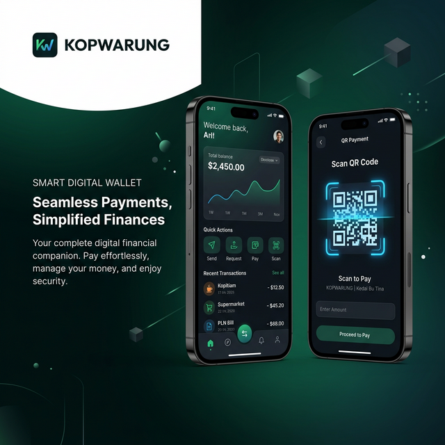

# 🌿 KOPWARUNG. Ecosystem
> **Digitalizing Local Economies through Cooperative Integration.**



## ✨ Premium Digital Cooperative Solutions
KOPWARUNG is a cutting-edge **Next.js 15** ecosystem designed to bridge the gap between traditional cooperatives and local neighborhood shops (warungs). Our platform enables seamless QR-based transactions, real-time commission monitoring, and centralized data management.

### 🚀 Live Interactive Modules
*   **[Member App Mockup](/)** - Experience the Alfagift-style interface with real-time QR shopping simulation.
*   **[Admin Control Dashboard](/dashboard)** - Manage partners, monitor global transactions, and process settlements with high-end fintech aesthetics.
*   **[Mitra (Warung) App](/mitra)** - Empower shop owners with a dedicated portal for sales tracking and automated withdrawals.
*   **[Mitra Onboarding](/mitra/register)** - Streamlined registration process for new shop partners.

---

## 🛠 Tech Stack (Enterprise Grade)
Built with the latest technologies to ensure performance, security, and scalability:
- **Core**: Next.js 15 (App Router), TypeScript.
- **Styling**: Tailwind CSS with custom glassmorphism components.
- **Animations**: Framer Motion for premium micro-interactions and smooth transitions.
- **Database**: Prisma ORM with SQLite (Demo Version).
- **Icons**: Lucide React.
- **UI Architecture**: Component-based with responsive mobile-first design.

---

## 💎 Features at a Glance
| Feature | Description | Status |
| :--- | :--- | :--- |
| **QR Payment Engine** | Simulate QR code scanning and instant balance deduction. | ✅ Ready |
| **Dynamic Settlement** | Real-time commission breakdown for cooperatives & mitra. | ✅ Ready |
| **Interactive Dashboard** | Dark-mode sidebar, active-feed, and growth analytics. | ✅ Ready |
| **ROI Calculator** | Built-in business tool for cooperative planning. | ✅ Ready |
| **Premium Branding** | Custom Logo & Banner designs for maximum impact. | ✅ Ready |

---

## 💰 Investment & Operational
Our ecosystem is designed for quick ROI. 
- **Development (MVP)**: ~Rp 60.000.000 (One-Time)
- **Maintenance**: ~Rp 750.000/Month (AWS/GCP Hosting)
- **Transaction Speed**: < 200ms API response time.

---

## 🔧 Local Development
1. Clone the repository:
   ```bash
   git clone https://github.com/errorcript/koperasi-digital.git
   ```
2. Install dependencies:
   ```bash
   npm install
   ```
3. Initialize the database:
   ```bash
   npx prisma generate
   ```
4. Run the development server:
   ```bash
   npm run dev
   ```

---

## 📞 Technical Inquiry & Discussion
Got a project idea? Let's discuss terms and technicalities.
**WhatsApp (Neoma - Bree)**: [+62 877-3454-7944](https://wa.me/6287734547944)

---
*Created with ❤️ by Antigravity (Advanced Agentic Coding)*
